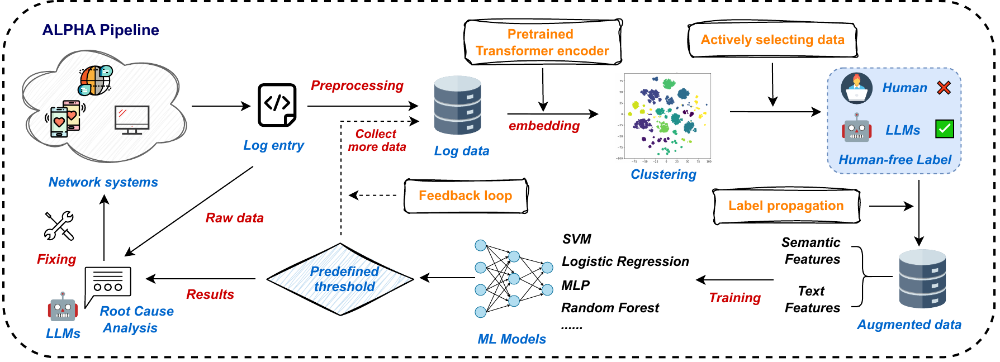

# ALPHA

This repository provides a reference implementation of **ALPHA: LLM-Enabled Active Learning for Human-Free Network Anomaly Detection**.

ALPHA is designed as a pipeline for applying LLM-assisted active learning to log anomaly detection. The code in this repository focuses on the main workflow components so that users can adapt the pipeline to their own log datasets:



1. Generate semantic embeddings for log messages.
2. Optimize the number of clusters.
3. Select representative samples from each cluster.
4. Use an LLM to label representative samples.
5. Propagate labels to the rest of each cluster.
6. Train a lightweight anomaly detector.
7. Use an LLM to analyze detected anomalous logs.

The full paper is available in this repository at [paper/ALPHA.pdf](paper/ALPHA.pdf), and on IEEE Xplore at [https://ieeexplore.ieee.org/abstract/document/11304694](https://ieeexplore.ieee.org/abstract/document/11304694).

## Repository Scope

This repository is intended as a reusable implementation guide rather than a complete dump of every experimental artifact. Large log datasets and generated intermediate files are not included in full. Users can prepare their own log data using the schema below and run the same pipeline logic on their data.

The included scripts show the core ALPHA stages:

```text
Cluster_optimization/
  elbow_and_silhouette.py      # choose the number of clusters
  epsilon.py                   # evaluate distance-threshold label flipping

Active_sampling_and_label_propagation/
  cluster_LLM.py               # cluster logs, label representatives with LLM, propagate labels
  prompting_cluster.py         # few-shot LLM prompting for anomaly labels
  error_anomaly.csv            # example anomalous few-shot cases
  error_normal.csv             # example normal few-shot cases

Train_detector/
  svm_active_llm.py            # train and evaluate an SVM detector from propagated labels

Anomaly_analysis/
  analysis.py                  # LLM-based root-cause analysis for anomalous logs

Data/
  testing_logs1.csv            # example test-set format
  testing_logs2.csv            # example test-set format
```

## Pipeline Overview

### 1. Prepare Log Data

Prepare a CSV file containing log messages and semantic embeddings. The clustering and label-propagation scripts expect a file similar to:

```text
log_id,label,remaining_log,embedding
```

Column meanings:

```text
log_id         Unique log identifier.
label          Optional ground-truth label. The current scripts treat "-" as normal and any other value as anomalous.
remaining_log  Raw or cleaned log message text.
embedding      A numeric embedding vector serialized as a list, for example "[0.12, -0.03, ...]".
```

In the paper experiments, log embeddings were generated with OpenAI `text-embedding-ada-002`, but the pipeline can use any embedding model that produces meaningful semantic vectors for logs. If you use your own embedding model, keep the `embedding` column format compatible with the scripts.

By default, several scripts look for:

```text
log_data_ten_thousand.csv
```

You can either place your prepared dataset under that name in the script directory you are running from, or update the input path in the corresponding script.

### 2. Optimize Clusters

Use elbow and silhouette analysis to choose the number of clusters:

```bash
cd Cluster_optimization
python elbow_and_silhouette.py
```

This script reads `log_data_ten_thousand.csv`, extracts the `embedding` column, standardizes the vectors, runs k-means for multiple `k` values, and saves:

```text
elbow.pdf
silhouette.pdf
```

In our paper experiments, `k = 15` gave a good balance between cluster compactness and separation.

### 3. Optional Epsilon Analysis

The epsilon script evaluates whether samples far from their assigned cluster center should have their propagated label flipped:

```bash
cd Cluster_optimization
python epsilon.py
```

In our experiments, the initial cluster labels were already reliable, so no distance-based label flipping was used in the final pipeline.

### 4. LLM-Based Representative Labeling and Label Propagation

Run the active sampling and label propagation stage:

```bash
cd Active_sampling_and_label_propagation
python cluster_LLM.py
```

The script performs the following steps:

1. Randomly samples increasing amounts of data.
2. Clusters log embeddings with k-means.
3. Selects the five samples closest to each cluster center.
4. Sends those representative logs to the LLM.
5. Uses majority voting to determine each cluster label.
6. Propagates that label to all logs in the cluster.

The generated training files are saved under:

```text
clustered_data/
```

Each output CSV contains the original logs plus:

```text
cluster
expanded_label
true_label
```

`expanded_label` is the propagated label used to train the downstream anomaly detector.

### 5. Configure the LLM

The LLM calls are implemented with `litellm` in:

```text
Active_sampling_and_label_propagation/prompting_cluster.py
Anomaly_analysis/analysis.py
```

Before running LLM-based scripts, configure:

```python
API_KEY = "your_api_key"
BASE_URL = "your_base_url"
MODEL = "gpt-4o"
```

You may also replace this with environment-variable based configuration if preferred.

The few-shot prompt examples are stored in:

```text
Active_sampling_and_label_propagation/error_anomaly.csv
Active_sampling_and_label_propagation/error_normal.csv
```

For a new log domain, we recommend replacing these examples with representative anomalous and normal logs from that domain.

### 6. Train the Detector

After label propagation, train a lightweight detector:

```bash
cd Train_detector
python svm_active_llm.py
```

This script trains an SVM using propagated labels and evaluates on two test sets. It expects:

```text
clustered_data_LLM/*.csv
testing_logs1.csv
testing_logs2.csv
```

If your generated propagated-label files are under `Active_sampling_and_label_propagation/clustered_data/`, either copy or symlink that directory as `clustered_data_LLM`, or update `folder_path` in `svm_active_llm.py`.

The included example test files use two schemas:

```text
testing_logs1.csv: LineId,Label,log
testing_logs2.csv: label,log_content
```

For your own data, either match these schemas or update the column names in `load_and_process_data()`.

### 7. Analyze Detected Anomalies

The root-cause analysis stage uses an LLM to summarize possible causes and next steps for anomalous logs:

```bash
cd Anomaly_analysis
python analysis.py
```

The script expects an input CSV with:

```text
remaining_log,formatted_label
```

where `formatted_label = 1` indicates an anomalous log. It writes:

```text
anomaly_analysis_results.csv
anomaly_analysis_report.txt
```

## Dependencies

The scripts require Python 3 and common scientific Python packages:

```text
pandas
numpy
scikit-learn
matplotlib
litellm
```

Install them with your preferred package manager, for example:

```bash
pip install pandas numpy scikit-learn matplotlib litellm
```

## Adapting ALPHA to Your Own Dataset

To use ALPHA on a new log dataset:

1. Clean or parse raw logs into one message per row.
2. Generate one embedding vector per log message.
3. Save a CSV with `log_id`, `label`, `remaining_log`, and `embedding`.
4. Run cluster optimization to choose `k`.
5. Replace the few-shot examples with examples from your log domain.
6. Run LLM-based cluster labeling and label propagation.
7. Train the detector using the propagated labels.
8. Run LLM-based analysis on detected anomalous logs.

Ground-truth labels are useful for evaluation, but they are not required for the ALPHA labeling pipeline itself. If your dataset does not have labels, you can omit evaluation fields and adapt the scripts to skip `true_label` comparisons.

## Notes

- Large raw datasets and generated intermediate files are intentionally not included.
- The scripts are written as research code and may require path adjustments for a new directory layout.
- The LLM output can vary across providers, models, and decoding settings. For stable experiments, record the model name, prompt examples, temperature, and run date.
- For privacy-sensitive logs, remove or anonymize identifiers such as IP addresses, usernames, hostnames, and file paths before sending logs to an external LLM provider.

## Citation

If you use this repository or build on ALPHA, please cite:

```bibtex
@inproceedings{xuanhaoluoALPHA2025,
  title     = {{ALPHA: LLM-Enabled Active Learning for Human-Free Network Anomaly Detection}},
  author    = {Luo, Xuanhao and Jha, Shivesh and Sinha, Akruti and Li, Zhizhen and Liu, Yuchen},
  booktitle = {{The 44th IEEE -- International Performance Computing and Communications Conference (IPCCC 2025)}},
  year      = {2025},
}
```
